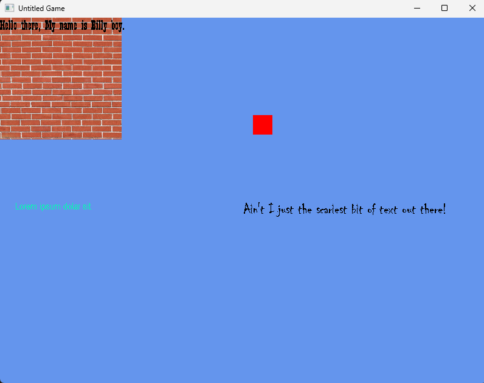

# 2d_gameTemplate
A template for creating 2D games using SDL2



A simple template that makes use of boilerplate code to incorperate basic functions that any game might require such as:
- Window Management
- Event Managemnt (Really janky, maybe use a singleton)
- Texture Loading and Rendering
- Font Loading and Text Rendering
- File System Management
  - Sets working fir to exec path.
  - Can search for files and perform validation on files
  - Can return a string of the complete path of a file/folder

In order to use the Window/Event Management system call the initializer for the Events class. Events is a child of the Window system. Doing so will initiate SDL, SDL_Image, SDL_TTF and create a window and renderer instance.
A game loop can be made by looping over `window->windowState`.
Update events: 
```
Events* window
window->updateEvents();

//Have your draw calls here --->

SDL_RenderPresent(window->renderer)
window->flushEvents()
```
